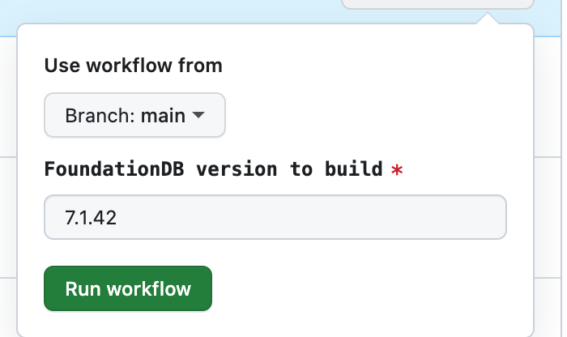

# fdb-docker


Dockerfiles to build FoundationDB dinaries that worn on both `arm64` and `amd64` architectures

## Building new versions in CI

### Step 1: Building the container image for the packages

Once done, this will produce a docker image that contains `pkg` files that can be used for the next step.

This part can take a very long time (several hours) to complete. It also requires both arm64/amd64 runners are present. 

1. Build the package container here: https://github.com/customerio/fdb-docker/actions/workflows/build-docker-pkg.yaml using the "Run Workflow" button
    a. Input the version you want to build


Once completed, you should be able to find the image here:
```
us-docker.pkg.dev/dev-staging-308107/devbox-containers/foundationdb:<versionnumber>-pkg
```

### Step 2: Building the runnable container image

This part is much faster. it uses the packages that were created in the preview image step, and make a runnable multi-arch build.

1. Build the package container here: https://github.com/customerio/fdb-docker/actions/workflows/build-docker.yaml using the "Run Workflow" button
    a. Input the version you want to build


Once completed, you should be able to find the image here:
```
us-docker.pkg.dev/dev-staging-308107/devbox-containers/foundationdb:<versionnumber>
```

## Building locally

```
docker build -f docker/fdb-pkg.Dockerfile docker --build-arg FDB_VERSION=7.1.42 -t foundationdb-pkg
```

```
docker build -f docker/fdb-binary.Dockerfile docker --build-arg FDB_VERSION=7.1.42 -t foundationdb
```

## Running precompiled image

```
docker run -p 4500:4500 -e FDB_NETWORKING_MODE=host us-docker.pkg.dev/dev-staging-308107/devbox-containers/foundationdb:7.1.42
```